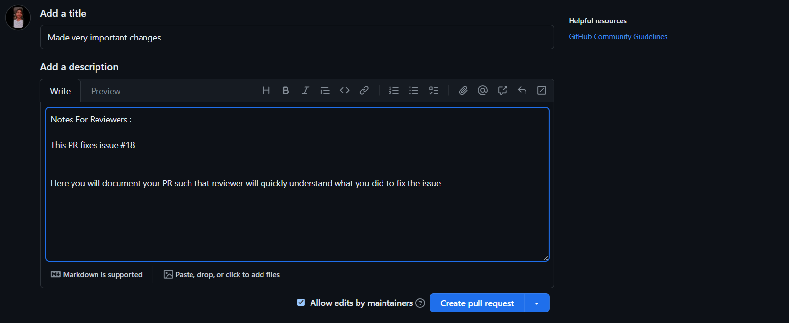

# BugThug 

A Code Debug Event (Duration- 2 hours) in which participants are required to debug the given code files/projects and/or develop new features as described in the issues specified. 

----

## Competition Description 
The competition is divided into two sections. 
1. BugBeatles *(Junior Section)*
2. BugHercules *(Senior Section)*

### BugBeatles 
This section of the competition is meant for the participants who are currently in **1st** or **2nd** year.
There are a total of **8 questions** in the Junior Section, comprising of
- *2 easy level* questions 
- *3 medium level* questions 
- *3 hard level* questions

### BugHercules 
This section of the competition is meant for the participants who are currently in **3rd** or **4th** year. 
There are a total of **9 questions** in the Senior Section, comprising of
- *4 easy level* questions
- *3 medium level* questions 
- *2 hard level* questions

## How to go about the competition?
The projects/files which are needed to be worked on have been uploaded in this repository to the respective folders for the competition i.e. BugBeatles (Junior Section) and BugHercules (Senior Section). 
To see what needs to be fixed or changed or added in those projects, open the *Issues* tab. Check the different labels on those issues, only work on a particular issue if it's meant for your section (according to the label).

### Your work flow should be
1. Clone the repository in your visual studio code
1. Then work on the projects/files according to the issues given.
1. After you're done working, stage the changes made.
   - git add . 
1. After making changes, don’t forget to commit with the sign-off flag (-s)! (It should include your name)
   - git commit -s -m "my commit message w/signoff"
1. Once all the changes have been committed, push the changes.
   - git push origin <(branch-name)>
1. Then create a pull request

### Pull Request Documentation
Each Pull Request should be well documented stating which PR is fixed and notes for reviewers.

Example :-
```
Notes For Reviewers

This issue fixes #{issue-number}

YOUR PR DOCUMENTATION GOES HERE
```



## Submission Guidlines - 
Each submission must include a detailed description of the bug(s) identified, the fix(es) implemented, and any relevant documentation.

## Code of Conduct - 
Participants must adhere to the code of conduct of respective projects they are contributing to. Respectful and constructive behaviour towards other participants and judges is mandatory. 

## Scoring Criteria - 
- Severity and complexity of bugs fixed.
- Quality and effectiveness of the fixes.
- Clarity and completeness of documentation.
- PR (Pull request) should be well documented.

## Judging Criteria - 
Submissions will be evaluated by a panel of judges based on the scoring criteria outlined above. 
Judges' decisions are final and binding.

## Disqualification - 
Participants found violating the code of conduct or engaging in unethical behavior will be disqualified. Plagiarism or dishonesty in submissions will result in immediate disqualification. 
